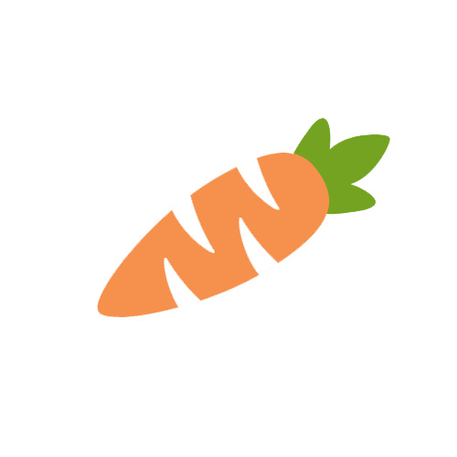
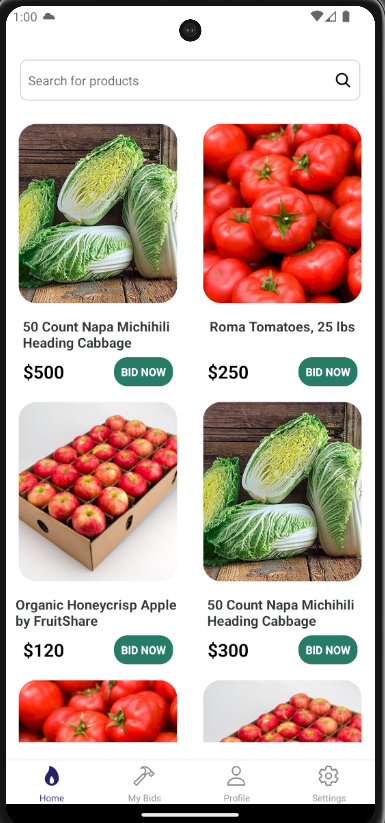
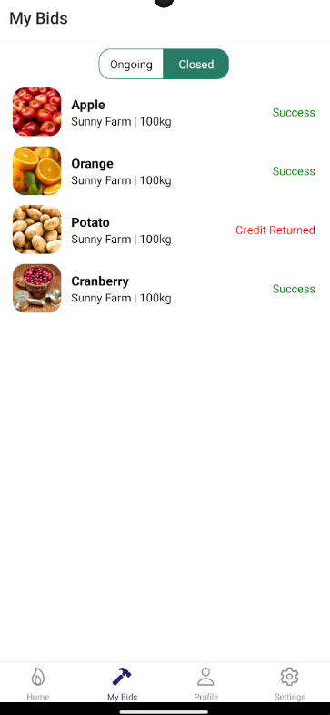
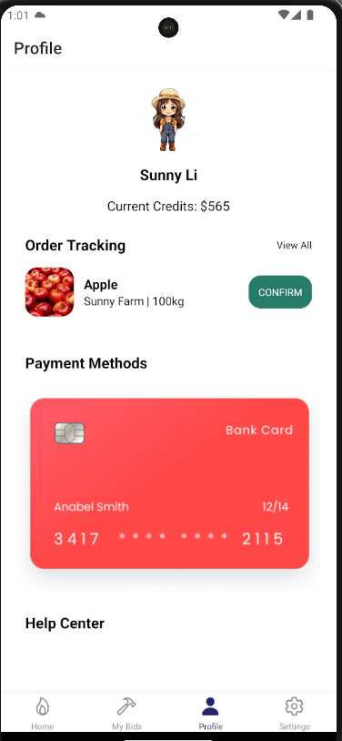
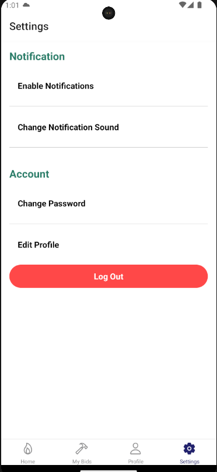

  

# FoodBids - Farm Product Auction App

FoodBids is a farm product auction app designed to address critical issues: reducing food waste, supporting farmers, and enhancing people's lives. 

## Technology Used

- **React Native**

- **TypeScript**

- **Passage API**

- **Python**

- **MongoDB**

## Screenshots

## Key Features

### 1. Product Auctions

- **Auction Your Farm Products**: Farmers can easily list their fresh produce for auction on the platform.

- **Bidding System**: Users can place bids on their desired products anytime and anywhere.

- **Winner Selection**: The app efficiently selects the highest bidder as the winner when the time is up.

### 2. Reduce Food Waste

- **Efficient Distribution**: FoodBids connects farmers directly with consumers, reducing the time food products spend in storage and minimizing food waste.

### 3. Supporting Farmers

- **Fair Pricing**: The auction system ensures fair prices for farm products, benefitting farmers.

- **Direct Access**: Farmers gain direct access to a broader customer base.

### 4. User-Friendly Interface

- **Filter Options**: Find the products you need with filter options, making the shopping experience more convenient.

- **Location Selection**: Choose the location that's most convenient for you, ensuring that you can access products near you.

- **Refined Search**: Improved search functionality helps you quickly locate the products you want.

- **Real-Time Updates**: Stay informed with real-time updates on product availability, bid status, and more.

### 5. Secure Transactions

- **App Wallet**: Introduced an app wallet where you can securely store your credits for hassle-free transactions.

## How to Get Started

1.  **Clone the Repository:** Start by cloning this repository to your local machine using the following command:

        git clone https://github.com/sunnydreamer/food-bids.git

2.  **Navigate to the Project Directory:** Change your current directory to the project's root folder:

        cd food-bids

3.  **Install Dependencies:** Install the required project dependencies by running:

        npm install

4.  **Set up EAS CLI** Install EAS CLI as a global npm dependency

        npm install -g eas-cli

5.  **Install expo-dev-client**

        npx expo install expo-dev-client

6.  **Login to your Expo account**:If you are new to Expo, sign up at: [Expo Signup](https://expo.dev/signup)

        eas login

7.  **Create a development build locally** Refer to [Expo Docs](https://docs.expo.dev/develop/development-builds/create-a-build/)

        eas build --profile development --platform android

8.  **Download the app on your emulator**: You can download it through the QR code or paste the link into your emulator's browser.

## Usage(Android and Web Only)

1.  **Go to the backend folder**: from root folder

        cd api

2.  **Run backend**

        python app.py

3.  **Frontend Setup**: on the root folder

        adb reverse tcp:5000 tcp:5000

4.  **Run frontend on the local build**:

        npx expo start --dev-client

If you prefer to use a simulator/emulator, you can do so by following the instructions provided by Expo. For example, you can run the project on an iOS simulator using Xcode on macOS or an Android emulator using Android Studio.
